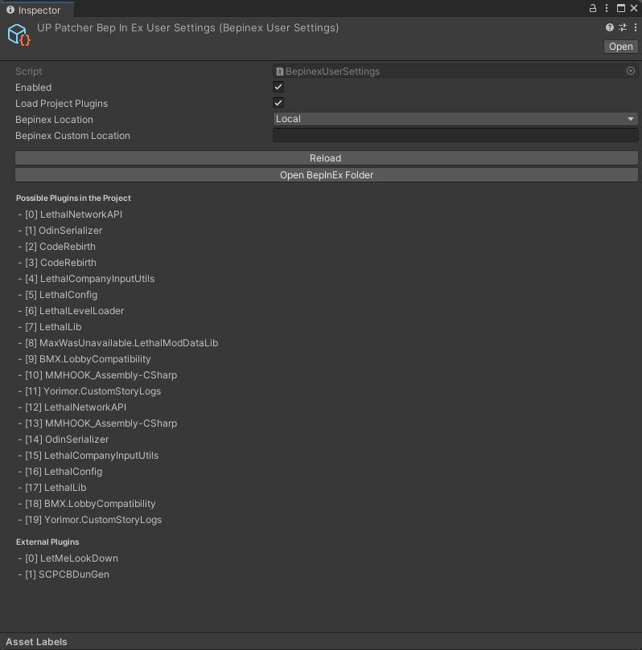
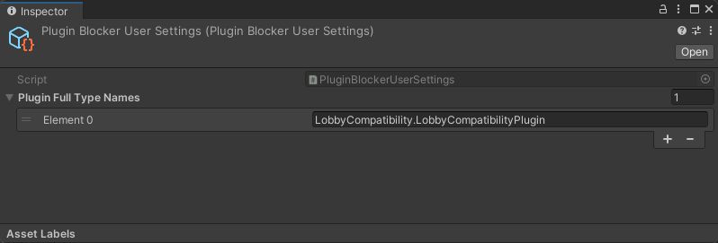

<div align="center">
  <h1>Unity Project Patcher BepInEx</h1>

  <p>
    A BepInEx handler for a Unity Project Patcher project
  </p>
</div>

<div align="center">
<!-- Badges -->

<span></span>
<a href="https://github.com/nomnomab/unity-project-patcher">Unity Project Patcher</a>
<span> · </span>
<a href="https://github.com/nomnomab/unity-project-patcher/issues/">Report Bug</a>
<span> · </span>
<a href="https://github.com/nomnomab/unity-project-patcher/issues/">Request Feature</a>
</h4>

</div>

<!-- Table of Contents -->
# Table of Contents

- [About the Project](#about-the-project)
    * [Features](#features)
- [Getting Started](#getting-started)
    * [Prerequisites](#prerequisites)
    * [Installation](#installation)
- [Usage](#usage)
  - [BepInEx Configs](#bepinex-configs)

<!-- About the Project -->
## About the Project

This allows a Unity project to utilize most of BepInEx plugins inside the editor

> [!IMPORTANT]  
> From testing, this does not seem to support preloader plugins that modify the Assembly-CSharp assembly, such as
> MMHOOK.
>
> For plugins that require dll generation, or other unique behaviours, run them on the game build first and then copy
> them into the editor's bepinex folder, or in the editor, for usage!

<!-- Features -->
## Features

- In-editor BepInEx usage
- Supports in-project plugins
- Supports local/game/custom BepInEx target directories
- Most plugins can be replaced in-place as long as they have no long lasting dll hooks
- And more

<!-- Getting Started -->
## Getting Started

### Already Bundled

This project is bundled with the following packages:

- [BepInEx](https://github.com/BepInEx/BepInEx)
- [MonoMod](https://github.com/MonoMod/MonoMod)

<!-- Prerequisites -->
### Prerequisites

- [Git](https://git-scm.com/download/win)
- [Unity Project Patcher](https://github.com/nomnomab/unity-project-patcher)

<!-- Installation -->
## Installation

> [!IMPORTANT]  
> These options require [git](https://git-scm.com/download/win) to be installed!

Install with the package manager:

1. Open the Package Manager from `Window > Package Manager`
2. Click the '+' button in the top-left of the window
3. Click 'Add package from git URL'
4. Provide the URL of the this git repository: `https://github.com/nomnomab/unity-project-patcher-bepinex.git`
  - If you are using a specific version, you can append it to the end of the git URL, such as `#v1.2.3`
5. Click the 'add' button

Install with the manifest.json:

1. Open the manifest at `[PROJECT_NAME]\Packages\manifest.json`
2. Insert the following as an entry:

```json
"com.nomnom.unity-project-patcher-bepinex": "https://github.com/nomnomab/unity-project-patcher-bepinex.git"
```

- If you are using a specific version, you can append it to the end of the git URL, such as `#v1.2.3`

#### Enabling this package

You can press the `Enable BepInEx` button in the tool window

Otherwise:

1. `Edit > Project Settings > Player > Other Settings > Scripting Define Symbols`
2. Add a new entry for `ENABLE_BEPINEX`
3. Press "Apply"
4. Wait for scripts to recompile

#### Disabling this package

You can press the `Disable BepInEx` button in the tool window

Otherwise:

1. `Edit > Project Settings > Player > Other Settings > Scripting Define Symbols`
2. Remove the entry for `ENABLE_BEPINEX` if it exists
3. Press "Apply"
4. Wait for scripts to recompile

### BepInEx Configs

### BepinexUserSettings
> [!NOTE]  
> Can be made via `Create > Unity Project Patcher > BepInEx User Settings`
>
> One will be made for you upon entering the game if one doesn't exist.



This config is where the main BepInEx settings are applied. It can also show you possible project-side plugins that
may get loaded, as well as external plugins found in the normal BepInEx plugins folder.

#### Enabled

Enables or disables BepInEx usage entirely.

#### Load Project Plugins

Enables or disables the usage of scanning for plugins within the project itself.

#### BepInEx Location

- Local: `[PROJECT_NAME]\[GAME_NAME]\BepInEx`
- Game: `[GAME_PATH]\BepInEx`
- Custom: A custom path to a `BepInEx` folder
  - Not fully tested yet

### PluginBlockerUserSettings
> [!NOTE]  
> Can be made via `Create > Unity Project Patcher > Plugin Blocker User Settings`



This lets you block plugins from running their `Awake` functions. Useful for plugins that use things that aren't
imported into the project, such as Steam usage.

Each name has to be in the format of `Namespace.TypeName`.